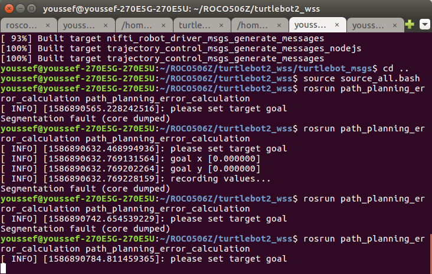
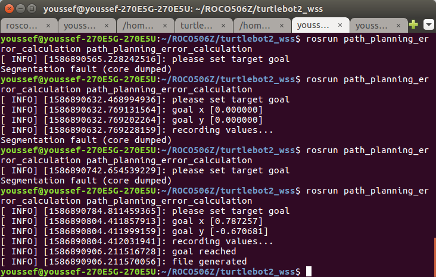
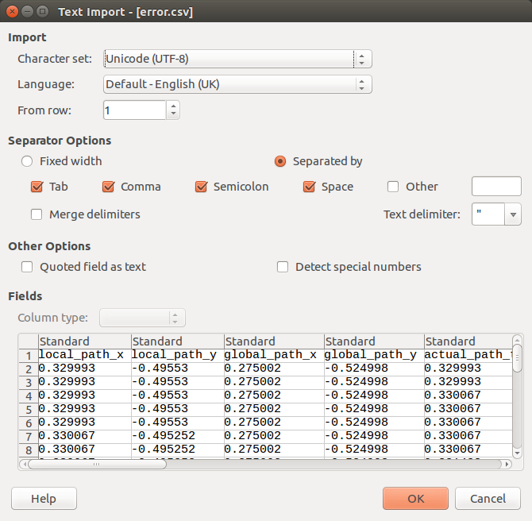
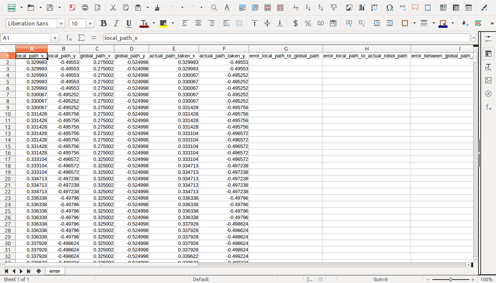
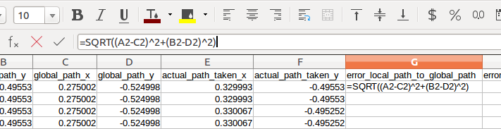
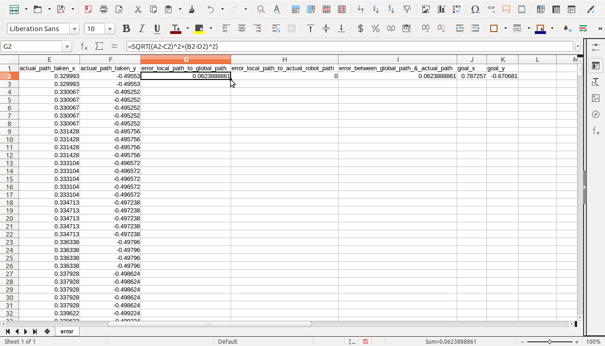
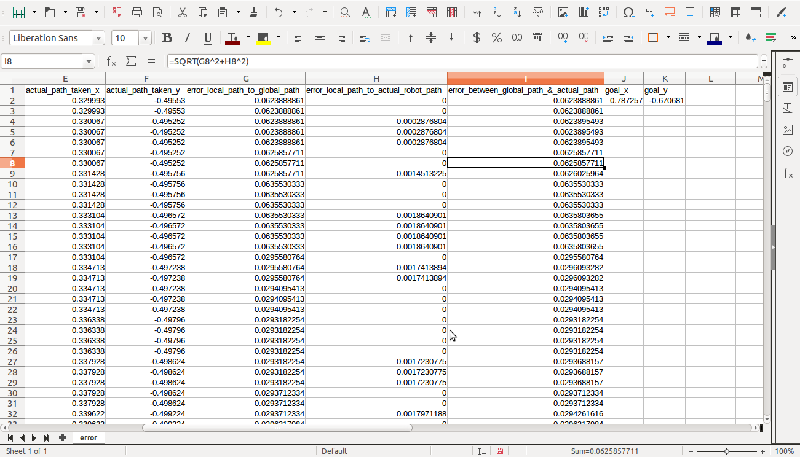
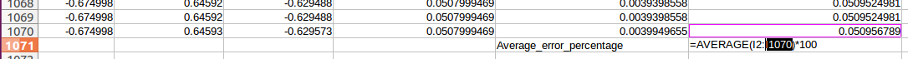
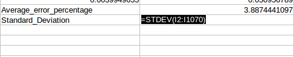
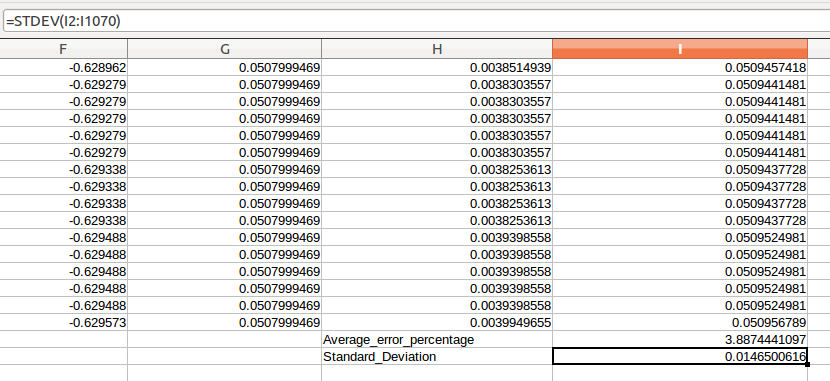

# Turtlebot ROCO506Z

This simulation shows turtlebot robot where it has multiple functionality SLAM, different implemented path planning algorithms, and finally error measurement between the actual path and planned path.

## Getting Started

Clone this repository in your home folder it's highly recommended to be cloned in your home folder for easier modifications. 

### Prerequisites

The following packages was tested using the following:

Ubuntu 16.04  
ROS kinteic   
VREP PRO EDU V 3.6.2  

Install the following packages before using these commands:

```
sudo apt install ros-kinetic-tf2*
sudo apt install ros-kinetic-move-base*
sudo apt-get install python-qt4
sudo apt-get install ros-kinetic-navigation
sudo apt-get install ros-kinetic-move-base ros-kinetic-pointcloud-to-laserscan ros-kinetic-slam-karto ros-kinetic-hector-*
sudo apt-get install -y python-wstool python-rosdep ninja-build
sudo apt install ros-kinetic-hector*
sudo apt-get install ros-kinetic-dwa-local-planner

```

### Installing

Open the folder (10666089_autonomous_nav) it contains a folder named turtlebot2_wss which is a meta package that contains multiple packages.

first catkin_make the package turtlebot_msgs.

```
cd ~/10666089_autonomous_nav/autonomous_navigation_wss/turtlebot_msgs/
catkin_make
```

and then source them. 

```
cd ..
source source_all.bash
```
and then repeat the same steps for each package except for (turtlebot_simulation).

turtlebot  
turtlebot_2dslam  
turtlebot_interaction  
turtlebot_map_and_nav  

for (turtlebot_simulation) you have to catkin build
'''
cd ~/10666089_autonomous_nav/autonomous_navigation_wss/turtlebot_simulation/
catkin build
cd ..
source source_all.bash
'''

Now After compiling and sourcing all packages lets start the simulation.

## Running the tests

first run roscore 

```
roscore
```
And then vrep
```
vrep
```
If the above command didn't work make sure you downloaded vrep files in your pc and make the following changes in .bashrc file.
```
gedit ~/.bashrc
source ~/.bashrc
```
then go to the bottom of the text file and add the following 2 lines. 
```
export VREP_ROOT=~/your_vrep_folder_path
alias vrep="cd $VREP_ROOT && ./vrep.sh"
```
Try and run vrep again  
if vrep is up and running go to file at the top left then open   

file->open  

then navigate to  
10666089_autonomous_nav/autonomous_navigation_wss/turtlebot_simulation/src/vrep_simulation/scenes/

and select the following scene:  

youssef_maze_scenario.ttt  

and click the play button to run the simulation.  

open a new terminal and go to the following folder and source it. 
```
cd ~10666089_autonomous_nav/autonomous_navigation_wss/
source source_all.bash
```

run the following command
```
roslaunch turtlebot_rviz_launchers vrep_turtlebot_rviz_launch.launch
```

Hector mapping is quite nice and gives accurate readings.

Run hector mapping launch file 
```
roslaunch turtlebot_2dslam/src/turtlebot_hector_mapping/turtlebot_hector_mapping.launch
```
navigate the robot using the keyboard arrows make sure you select the the window that pops up when you run the command so you could navigate the robot.
```
roslaunch turtlebot_teleop_keyboard keyboard_teleop_diff_drive.launch
```
As the robot moves around, a map is build around check the video for Hector mapping SLAM in the videos  folder.
### Point-To-Point Path Planning (PTP-PP)
Here you after you build your 2D map using Hector SLAM you will selct point on the map and the robot will move to this point avoiding obstacles using move base using dijkstra path planning algorithm. 

run the launch file for robot path planning navigation using 
```
roslaunch turtlebot_navigation turtlebot_move_base.launch
```
and select any point on the map an automated path will be generated and the robot will follow it and move to the selected target point.

NB  
(My machine hardware is limited and the simulation for path planning is so slow if you have a better hardware capabilities you might want to change the transform tollerance parameter in "/10666089_autonomous_nav/autonomous_navigation_wss/turtlebot_map_and_nav/src/turtlebot_navigation/param/" in files:  
```  
-turtlebot_global_costmap_params.yaml  
-turtlebot_local_costmap_params.yaml  
```
and if you want to change the thepath planning algorithim from dijkstra to A* you can do in the file:   
-turtlebot_local_costmap_params.yaml  
and set use_dijkstra: false
```
use_dijkstra: false 
```
other path planning algorithms are used will be shown later in this project. 

Check the videos folder showing how to use the package.

### Error measurement between global path planned and actual path taken by the robot
Here i have implemented a c++ script which automatically collects the robots position and actual robot path taken and compare it to the robots global path planned and publish the robots coordinates to an ecxel or .csv file using this spreadsheet we will calculate the mean and standard deviation (standard deviation is the calculation of how far the robots position is from the mean error).

so first you must have all the previous explained packages up and running an make sure you first have selected a point for the robot to move to initially before running the error measurement node. (eg. if you have just launched the PTP-PP package give the robot a near point position to navigate to before running the error measurment node), very crucial for the node to run successfully.


now after you made sure that you gave an initial position to the robot to go to and the robot reached that goal run the error measurement node but first open the file ~/10666089_autonomous_nav/autonomous_navigation_wss/turtlebot_msgs/src/path_planning_error_calculation/error_calculation.cpp, and make sure the set path is the path you want to store your .csv file by replacing the "XXXX" with your pc name assuming you done everything right it's default location assuming you clonned the repository in the home folder will be inside /10666089_autonomous_nav folder otheriwse an error might occur or you might not find the file if the file path is not modified.  

then run:
```
rosrun path_planning_error_calculation path_planning_error_calculation
```
the terminal will print "please set target goal" as soon you choos your target goal data will be recorded as long as the robot moves.



As soon the robot reaches it's point the terminal will print "goal reached" and the file will be generated into it's saved path.
Now lets' go to the .csv file generated!



### Error calculation  

the file is saved named "error.csv" open the file.

make sure separated by space is selected and press "ok"


A similar spread sheet will be shown:

Navigate to cell G2 and type the following formula   

```
=SQRT((A2-C2)^2+(B2-D2)^2)
```  


Navigate to cell H2 and type the following formula and press "ENTER"  

```
=SQRT((A2-E2)^2+(B2-F2)^2)
```
Navigate to cell I2 and type the following formula and press "ENTER"  
```
=SQRT(G2^2+H2^2)
```
and replicate the same formula for the rest cells by double clicking and the buttom right of the cell to auto complete as shown in the picture below:  


At the end you will find a full spreadsheet as shown in this picture
  


Now navigate to the very bottom end you wil find "Average_error_percentage" delete the cell next to it and type the following: 

NB:replace the X letter with just the cell letter and number above it
```
=AVERAGE(I2:X)*100 
```


The number shown next to "Average_error_percentage" is in percent representing the mean error

If want to calculate the standard deviation apply the exact same for the cell bellow and type this formula:  
NB:replace the X letter with the same cell letter and number that set in the average.  
```
=STDEV(I2:X)
```


In the spread sheet you calculated the mean (Average_Error_Percentage) and the Standard Deviation which how far the path the robot was taking from the the average path error.
  
Now basically you have calculated the average error percentage between the global path and the actual path taken by the robot most of my expeiments was between 3~10 % which is fairly accurate and acceptable. 
 
### EXTRA Improvement to the State of the Art

In this secion i chose to improve the path planning algorithm by applying different path planning methods to th state of the art. The importance of this section is not easily identifiable as different path planning algorithims has it's advantages and disadvantages such as getting stuck in local minima or high computational time for path calculation etc. check this [paper](http://www.dropwizard.io/1.0.2/docs/) for further details about the importance of different path planning algorithims and the importance of each.   

Change the vrep scene and open the scene "youssef_testing_pp_algorithm" in ('10666089_autonomous_nav/autonomous_navigation_wss/turtlebot_simulation/src/vrep_simulation/scenes/') this scene is more empty with less obstacles where you can notice the robots path easier. The implemented algorithim doesn't see obstacles so make sure the set target point for the robot doesn't have an obstacle in between.

Leaving all up and running including hector SLAM and close any running path planning launch files and run the following launch file:
```
roslaunch turtlebot_navigation turtlebot_move_base_pp.launch
```
It's default set is Breadth-First Search Algorithim that can be changed to different algorithims such as:  

* A*  
* Dijkstra  
* Jump Point Search   
* Breadth-First Search  

to change it open the file pathplanners.cpp "/10666089_autonomous_nav/autonomous_navigation_wss/turtlebot_map_and_nav/src/turtlebot_navigation/src/pathplanners.cpp" and go to line 211, you'll find 4 lines as following:
```
	 //bestPath=AStar(startCell, goalCell,  g_score);  
	 //bestPath=Dijkstra(startCell, goalCell,  g_score);  
	 bestPath=BFS(startCell, goalCell,  g_score);  
	 // bestPath=JPS(startCell,goalCell,g_score);  
```
As Breadth-First Search is the default and implemented it will be uncommented if you want to change to Jump Point Search simply comment the uncommented line and uncomment your intended algorithm to use like this example.
```
	 bestPath=AStar(startCell, goalCell,  g_score);  
	 //bestPath=Dijkstra(startCell, goalCell,  g_score);  
	 //bestPath=BFS(startCell, goalCell,  g_score);  
	 // bestPath=JPS(startCell,goalCell,g_score);   
```
In this example we changed to A* path planning algorithm.

catkin_make again and source it again and relaunch the launch file again and the new algorithm is set. 
This package was implemented and based and build up upon from this [github repositiory](http://www.dropwizard.io/1.0.2/docs/)

## Deployment

* Additional Videos can be found for each implementation showing how it works and how to use it.  
* Images folder is found in this repository as well helping you showing how this implementation works.  
* sample_files folder contains the map for the scene in .yaml file, also it has an implemented example error.csv file for futher referencing and help.

## Built With

* [ sahibdhanjal/Path-Planning-Simulator ](https://github.com/sahibdhanjal/Path-Planning-Simulator) - github repository used for different path planning algorithms implementation.

## Authors
* **Mario Giaoni** - *Initial work* 
* **Youssef Hindi** - *Implemented These additional functionalities* 
* **Sahib Singh Dhanjal** - *Used his Path planning algorithm node* - [Github Repository](https://github.com/sahibdhanjal/Path-Planning-Simulator)

## Acknowledgments

* Thanks Mario for giving initial work to start withand build on 
* Thanks Sahib Dhanjal for your path planning node
* Inspiration


